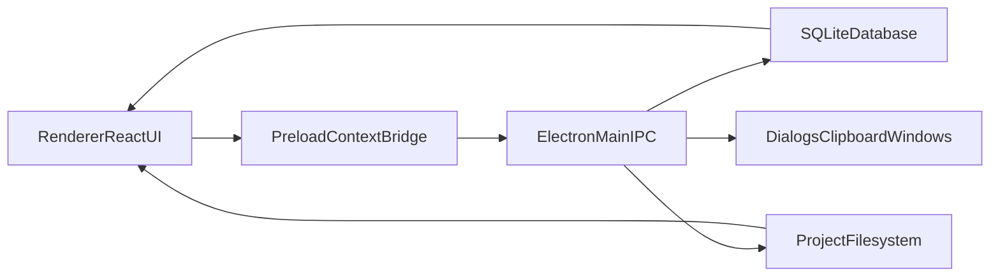

# Architecture Reference

## LLM Quick Context
- **Read this when:** you need the system-level picture (process boundaries, startup lifecycle, and runtime flow).
- **Primary source files:** `game_docs/src/main.tsx`, `game_docs/src/App.tsx`, `game_docs/electron/preload/index.ts`, `game_docs/electron/main/index.ts`, `game_docs/electron/main/config.ts`, `game_docs/electron/main/update.ts`.
- **One-line model:** PlayerDocs is an Electron desktop app where a React renderer drives UX, while the Electron main process owns persistence, filesystem access, and all privileged operations through `gamedocs:*` IPC handlers.

## General Idea
PlayerDocs is a campaign/world documentation tool focused on linked knowledge:
- Campaigns contain hierarchical objects (places, people, lore, etc.).
- Object content is edited in a rich text-like `contentEditable` surface.
- Inline links (`[[Label|tag_id]]`) connect objects into a navigable graph.
- Images, exports, backup/restore, and settings are managed via main-process IPC.

## Runtime Topology

## App Entry and Startup Lifecycle
1. **Renderer boot**
   - `game_docs/index.html` loads `game_docs/src/main.tsx`.
   - `main.tsx` mounts `App` under `ToastProvider` and `ConfirmProvider`.
2. **Renderer routing**
   - `App.tsx` uses `location.hash`:
     - `#/editor/<gameId>` -> `Editor`
     - `#/map?...` -> `PlaceMap`
     - otherwise -> `ProjectSetup`
3. **Main process boot**
   - `electron/main/index.ts` enforces single instance with `app.requestSingleInstanceLock()`.
   - On `app.whenReady()`:
     - Reads config (`config.ts`) from `%LOCALAPPDATA%/PlayerDocs/config.json` on Windows.
     - If no configured project directory, prompts user to pick/create one.
     - Ensures scaffold directories (`games`, `backups`, `export`).
     - Registers `gamedocs:*` IPC handlers.
     - Creates the main window (`createWindow()`).
4. **Bridge**
   - `electron/preload/index.ts` exposes `window.ipcRenderer` (`on`, `off`, `send`, `invoke`) via `contextBridge`.
5. **Updates**
   - `update.ts` wires Electron auto-update channels (`check-update`, `start-download`, `quit-and-install`) and sends renderer events.

## Window Model
- **Main window:** campaign setup/list management.
- **Editor window:** dedicated route for campaign editing (`#/editor/<id>`).
- **Map window:** place graph view (`#/map?gameId=...`).
- Main process persists and restores window geometry in `settings` (e.g., `ui.mainWindow`, `ui.mapWindow`).

## Main Data/Control Flows

### Campaign startup
1. `ProjectSetup` requests `gamedocs:list-campaigns`.
2. User opens campaign -> `gamedocs:open-campaign`.
3. Editor route loads and requests campaign/root/children (`get-campaign`, `get-root`, `list-children`).

### Editing loop
1. User edits content in `Editor`.
2. Renderer updates local `desc` state from DOM serialization.
3. Debounced save invokes `gamedocs:update-object-description`.
4. Main process updates SQLite row.

### Link traversal
1. Renderer parses link spans (`data-tag`) in content.
2. On click/hover, renderer asks `gamedocs:list-link-targets`.
3. If one target, navigate directly; if many, show disambiguation menu.

### Export/import
1. Export commands invoke `gamedocs:export-to-html`, `gamedocs:export-to-pdf`, or `gamedocs:export-to-share`.
2. Import commands invoke `gamedocs:import-from-share` or DB-level backup restore handlers.
3. Main process performs filesystem/database work and returns result metadata.

## Process Responsibilities

### Renderer (`src`)
- UI rendering, local interaction state, keyboard handling, link UX, command palette behavior.
- Never touches filesystem/DB directly.

### Preload (`electron/preload`)
- Narrow IPC bridge exposure.

### Main (`electron/main`)
- Source of truth for persistence and side effects:
  - SQLite operations
  - filesystem reads/writes/copies
  - dialogs, clipboard, window orchestration
  - backup/import/export and thumbnail generation

## Current Architecture Characteristics
- **Strength:** clear privilege boundary (renderer -> IPC -> main).
- **Strength:** centralized operations in one main-process module.
- **Tradeoff:** `electron/main/index.ts` and `src/components/Editor.tsx` are very large and act as "god files."
- **Tradeoff:** hash routing is lightweight but intentionally simple (no formal router library).

## Known Caveats
- FTS table exists in schema, but quick search currently uses SQL `LIKE` paths (not FTS query-driven).
- Some features are partially wired (e.g., sibling shortcut handlers in editor are present but not fully implemented).
