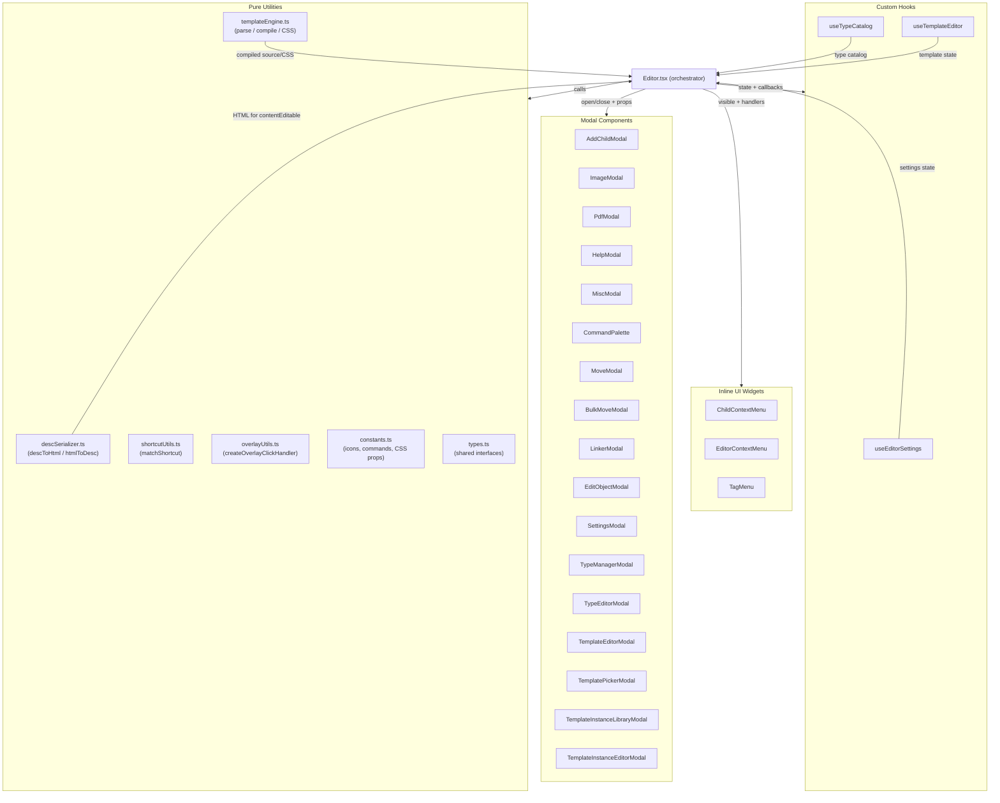

# Editor Frontend Structure

## LLM Quick Context
- **Read this when:** you need to understand how `Editor.tsx` is organized after the modular refactor, locate a specific UI concern, or add a new modal/menu/hook.
- **Primary source root:** `game_docs/src/components/editor/`
- **One-line model:** `Editor.tsx` is the orchestrator that wires together pure utilities, custom hooks, modal components, and inline UI widgets — each extracted to a focused file under `game_docs/src/components/editor/`.

---

## File Tree

```
game_docs/src/components/
├── Editor.tsx                          # Orchestrator: state, effects, render pipeline
├── InlinePdfViewer.tsx                 # Standalone pdfjs-dist PDF renderer component
└── editor/
    ├── types.ts                        # All shared TypeScript interfaces
    ├── constants.ts                    # CSS_PROPERTY_OPTIONS, ALL_REMIX_ICONS, listOfCommands
    ├── shortcutUtils.ts                # matchShortcut() keyboard helper
    ├── descSerializer.ts               # descToHtml(), htmlToDesc(), token normalizers
    ├── templateEngine.ts               # Template parse/compile/style-block utilities
    ├── overlayUtils.ts                 # createOverlayClickHandler() for backdrop dismiss
    ├── ModalShell.tsx                  # Generic backdrop + card wrapper for all modals
    │
    ├── useEditorSettings.ts            # Hook: palette, fonts, shortcut map, auto-save
    ├── useTypeCatalog.ts               # Hook: object-type CRUD, icon picker, tag autocomplete
    ├── useTemplateEditor.ts            # Hook: template defs, visual builder, instances
    │
    ├── modals/
    │   ├── AddChildModal.tsx           # Create new child object
    │   ├── ImageModal.tsx              # Lightbox for full-size images
    │   ├── PdfModal.tsx                # Lightbox for PDF files (uses InlinePdfViewer)
    │   ├── HelpModal.tsx               # Keyboard shortcuts and usage tips
    │   ├── MiscModal.tsx               # Export, PDF, HTML, map launch
    │   ├── CommandPalette.tsx          # Fuzzy search + command execution palette
    │   ├── MoveModal.tsx               # Move one object to a new parent
    │   ├── BulkMoveModal.tsx           # Select + bulk-move multiple objects
    │   ├── LinkerModal.tsx             # Link selected text to existing/new objects
    │   ├── EditObjectModal.tsx         # Rename, retype, tags, links, images, attachments
    │   ├── SettingsModal.tsx           # All editor settings (palette, fonts, shortcuts…)
    │   ├── TypeManagerModal.tsx        # Type catalog table + delete/switch sub-modals
    │   ├── TypeEditorModal.tsx         # Create/edit an object type with icon picker
    │   ├── TemplateEditorModal.tsx     # Visual template builder + raw source editor
    │   ├── TemplatePickerModal.tsx     # Flat list for inserting a template instance
    │   ├── TemplateInstanceLibraryModal.tsx  # Campaign-wide template instance browser
    │   └── TemplateInstanceEditorModal.tsx   # Edit field values of a template instance
    │
    └── ui/
        ├── ChildContextMenu.tsx        # Right-click menu for sidebar child items
        ├── EditorContextMenu.tsx       # Right-click menu in the description editor area
        └── TagMenu.tsx                 # Left-click popup for multi-target tokens
```

---

## Data-Flow Diagram



---

## Module Responsibilities

### `Editor.tsx` (orchestrator)
Owns the full React state tree: active object, description, children, images, attachments, menu visibility flags, and all modal open/close state. Delegates sub-concerns to hooks and pure utilities. Renders the top-level layout, wires modal props, and handles all IPC calls not already encapsulated in a hook.

### `types.ts`
Single source of truth for every shared TypeScript interface (`Campaign`, `ObjectType`, `TemplateDef`, `TemplateInstance`, `Attachment`, `TemplateVisualField`, `TemplateStyleBlock`, etc.). Import from here rather than from `Editor.tsx`.

### `constants.ts`
Static data that never changes at runtime:
- `CSS_PROPERTY_OPTIONS` — autocomplete suggestions for the style-block editor.
- `ALL_REMIX_ICONS` — full list of Remix icon class names, derived from the SCSS source.
- `listOfCommands` — command palette command definitions.

### `shortcutUtils.ts`
Single function `matchShortcut(event, binding)` that checks a `KeyboardEvent` against a binding string such as `"Ctrl+K"` or `"Shift+Alt+F"`.

### `descSerializer.ts`
Converts between the internal token-based description text and displayable HTML:
- `descToHtml(text, options)` — tokenizes `[[label|id]]` references, wraps in styled `<span>` elements, injects template instances.
- `htmlToDesc(html)` — strips DOM formatting back to the canonical token text.
- `normalizeTemplateSpacing` / `removeMissingTags` — post-processing helpers.

### `templateEngine.ts`
All pure template logic:
- `parseTemplateFields` / `parseTemplateMeta` — parse a source string into a field tree.
- `normalizeTemplateFields` — flatten and sort fields by `order`.
- `buildTemplateSourceFromVisual` — compile visual fields back to source syntax.
- `createStyleBlock` / `createStyleDecl` — factory helpers for the style-block editor.
- `buildCssFromStyleBlocks` / `parseCssToStyleBlocks` — convert between style-block objects and raw CSS strings.

### `overlayUtils.ts`
`createOverlayClickHandler(setter)` returns a `{ onMouseDown, onClick }` event spread that closes a modal when the user clicks the backdrop but not the card itself.

### `ModalShell.tsx`
Generic backdrop + centered card wrapper. Pass `onClose` and `children`; the shell handles backdrop click-to-dismiss with `overlayUtils`.

### Custom Hooks

| Hook | Manages |
|------|---------|
| `useEditorSettings` | Theme palette, font selections, shortcut map, auto-save interval, `applyPalette`, `applyFonts` |
| `useTypeCatalog` | `objectTypes` list, CRUD operations (create/update/delete/switch), icon picker state, tag autocomplete |
| `useTemplateEditor` | Template definitions, visual builder fields and style blocks, template instances, attachments |

### Modals
Each modal component receives its open/close state, required data slices, and callback functions as props from `Editor.tsx`. No modal holds its own IPC calls unless tightly scoped (e.g. inline hover-preview fetches in `TagMenu`).

### Inline UI Widgets (`ui/`)
`ChildContextMenu`, `EditorContextMenu`, and `TagMenu` are fixed-position overlays rendered in the main layout rather than as modal dialogs. They receive `menuRef` for outside-click detection managed by the parent.

---

## Adding a New Modal

1. Create `game_docs/src/components/editor/modals/YourModal.tsx`.
2. Define a `YourModalProps` interface with `visible: boolean` and an `onClose` callback.
3. Return `null` when `!visible`.
4. Use `ModalShell` or inline backdrop pattern from `overlayUtils.ts`.
5. Add the `visible` state and open/close handler in `Editor.tsx`.
6. Import and render `<YourModal ... />` near the bottom of `Editor.tsx`'s JSX.
7. Add JSDoc to the file header and the props interface.
